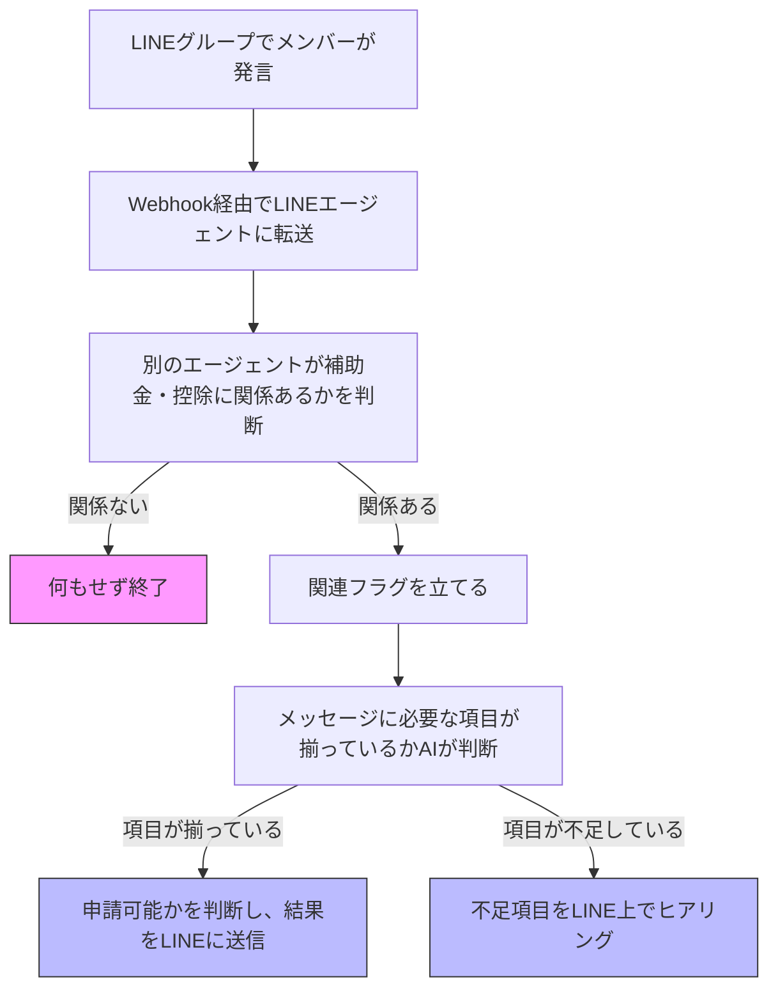

# 2025-zenn-hackathon2

```mermaid
graph TD;
    A[LINEグループでメンバーが発言] --> B[Webhook経由でLINEエージェントに転送]
    B --> C[別のエージェントが補助金・控除に関係あるかを判断]
    
    C -- 関係ない --> D[何もせず終了]

    C -- 関係ある --> E[関連フラグを立てる]
    E --> F[メッセージに必要な項目が揃っているかAIが判断]
    
    F -- 項目が揃っている --> G[申請可能かを判断し、結果をLINEに送信]
    F -- 項目が不足している --> H[不足項目をLINE上でヒアリング]

    style D fill:#f9f,stroke:#333,stroke-width:1px
    style G fill:#bbf,stroke:#333,stroke-width:1px
    style H fill:#bbf,stroke:#333,stroke-width:1px
```
