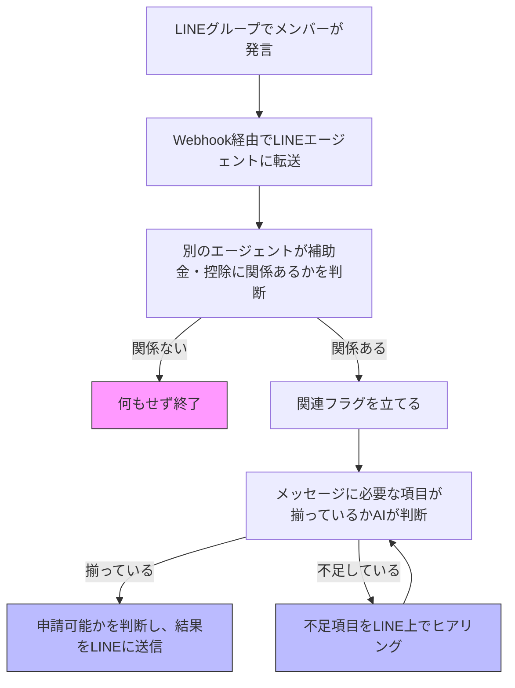
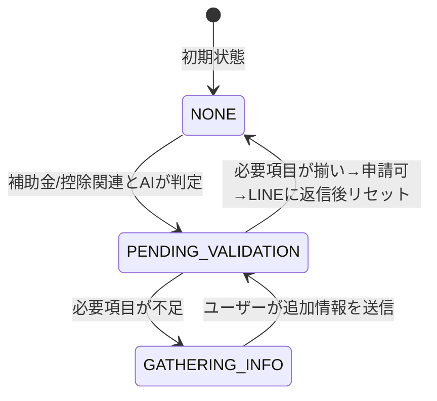

# 2025-zenn-hackathon2

## 会話状態の遷移図

## 会話フラグの分類と意味
フラグ状態	説明
NONE（=フラグなし）	初期状態。普通の会話中で、何も状態を保持していない
PENDING_VALIDATION	AIが補助金/控除に関連する内容と判定し、項目チェック（揃っているノード）に進んだ状態
GATHERING_INFO	不足項目があり、ヒアリングを開始した状態。情報が揃えば完了に進む

## フラグ状態の推移図（Mermaid）

## 状態遷移のタイミング
タイミング	フラグ変更	処理内容
AIが補助金・控除関連と判断したとき	NONE → PENDING_VALIDATION	項目チェックに進む
必要項目が不足していたとき	PENDING_VALIDATION → GATHERING_INFO	ヒアリング開始
不足項目が補われたとき	GATHERING_INFO → PENDING_VALIDATION	再チェックへ戻る
すべて揃って申請可になったとき	PENDING_VALIDATION → NONE	LINEに返答後、状態リセット

💡補足
タイムアウト（例：5分で自動的にNONEに戻す）も併用すると、意図しない「フラグ残りっぱなし」を防げます。
状態と一緒に、収集済みの項目データも格納しておくと便利？
