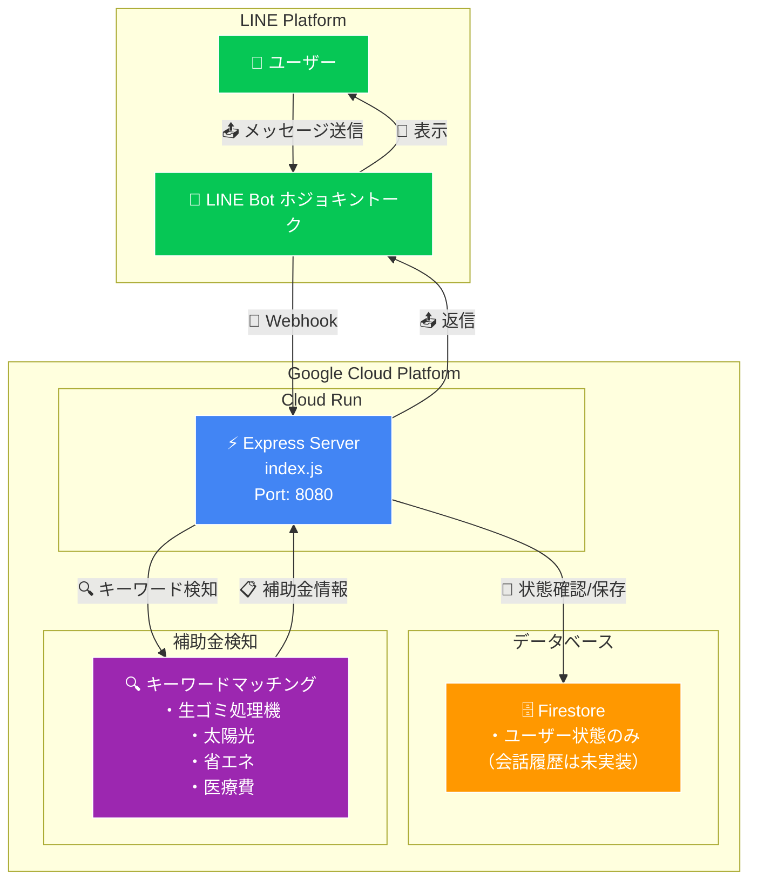
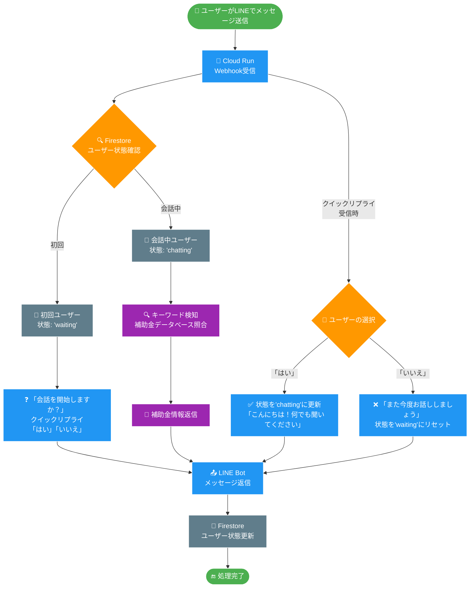
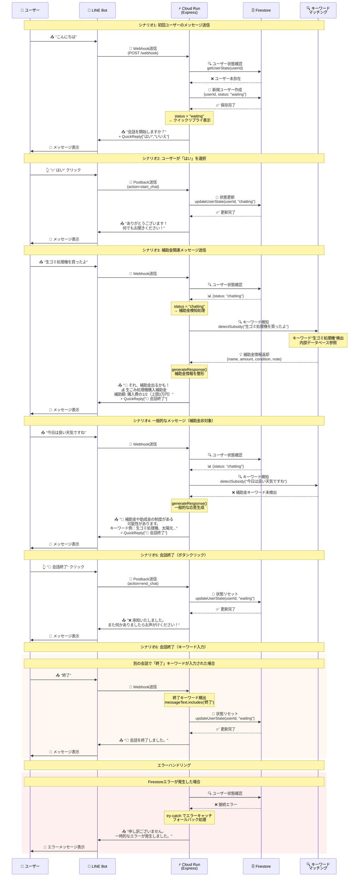

# ⚠️ 基本版（MVP）について

現在のバージョンは基本機能のみ実装されています：
- ✅ 簡易的なキーワードマッチングによる補助金検知
- ✅ ユーザー状態管理（waiting/chatting）
- ❌ Vertex AI/Gemini APIは未実装
- ❌ 会話履歴保存は未実装
- ❌ 高度な自然言語処理は未実装

# コマンドMEMO

## CloudRunデプロイ

```bash
gcloud run deploy [cloud run name] \
    --source . \
    --region asia-northeast1 \
    --allow-unauthenticated \
    --project [google project name] \
    --set-secrets="LINE_CHANNEL_ACCESS_TOKEN=[secret name]:latest,LINE_CHANNEL_SECRET=[secret name]:latest" \
    --set-env-vars="GOOGLE_CLOUD_PROJECT_ID=[google project id]"
```

## Webhook URL確認

```bash
gcloud run services describe line-bot-service-enable-ai-talk \
  --region asia-northeast1 \
  --format "value(status.url)"
```

## ヘルスチェック確認

```bash
curl https://[YOUR_CLOUD_RUN_URL]/health
```

## Firestore 初期設定

1. Firestoreデータベース作成

```bash
# Firestore API有効化（念のため確認）
gcloud services enable firestore.googleapis.com
# Firestoreデータベース作成（ネイティブモード）
gcloud firestore databases create --location=asia-northeast1
```

2. Cloud Runサービスアカウント権限設定

```bash
# プロジェクト番号取得
PROJECT_NUMBER=$(gcloud projects describe [YOUR_PROJECT_ID] --format="value(projectNumber)")
echo "Project Number: $PROJECT_NUMBER"
# Firestore権限付与
gcloud projects add-iam-policy-binding [YOUR_PROJECT_ID] \
    --member="serviceAccount:${PROJECT_NUMBER}-compute@developer.gserviceaccount.com" \
    --role="roles/datastore.user"
```

## Vector AI 有効化

1. Vertex AI API有効化確認

```bash
# Vertex AI API有効化
gcloud services enable aiplatform.googleapis.com
# 有効化確認
gcloud services list --enabled --filter="name:aiplatform.googleapis.com"
```

2. サービスアカウント権限設定

```bash
# Vertex AI利用権限付与
gcloud projects add-iam-policy-binding [YOUR_PROJECT_ID] \
    --member="serviceAccount:${PROJECT_NUMBER}-compute@developer.gserviceaccount.com" \
    --role="roles/aiplatform.user"
# 権限確認
gcloud projects get-iam-policy [YOUR_PROJECT_ID] \
    --flatten="bindings[].members" \
    --format="table(bindings.role)" \
    --filter="bindings.members:${PROJECT_NUMBER}-compute@developer.gserviceaccount.com"
```


1. Vertex AI API有効化確認

# 構成図



# 処理のフロー



# シーケンス



## 現在対応している補助金キーワード

現在、以下のキーワードに反応して補助金情報を提供します：

- **生ゴミ処理機** - 生ごみ処理機購入補助金（購入費の1/2、上限3万円）
- **太陽光** - 太陽光発電設備導入補助金（1kWあたり2-4万円）
- **省エネ** - 省エネリフォーム補助金（工事費の10-30%）
- **医療費** - 医療費控除（年間医療費が10万円超で所得税・住民税軽減）

※実際の補助金額や条件は自治体により異なります。詳細はお住まいの市区町村役場でご確認ください。